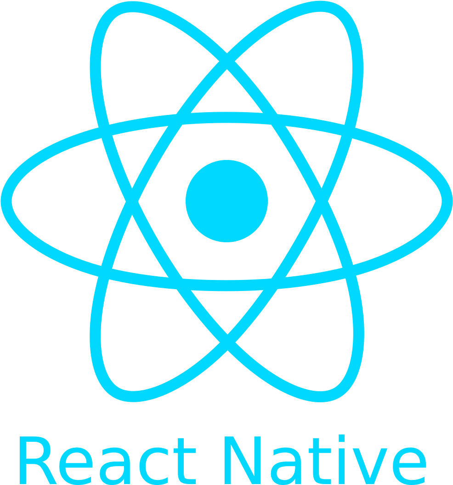

<h1 align="center">Hi there, I'm Martin Cappi Dahl 👋</h1>
<h3 align="center">A Full Stack Developer from Argentina</h3>

[][1]

<h4 align="center">Languages & Toolkit:</h4>

<!-- JavaScript -->

<!-- PHP -->

<!-- Python -->

 
<!-- HTML5 -->

<!-- CSS3 -->

 
<!-- ReactJS -->

<!-- Redux -->

<!-- ReactNative -->

<!-- NodeJS -->

<!-- ExpressJS -->

 
<!-- SQL -->

<!-- MongoDB -->

<!-- Firebase -->

 
<!-- SASS -->

<!-- Bootstrap -->

 
<!-- Git -->

<!-- Only works when repo is set to public -->
<!--  -->

<!--
**nepha199/nepha199** is a ✨ _special_ ✨ repository because its `README.md` (this file) appears on your GitHub profile.

Here are some ideas to get you started:

- 🔭 I’m currently working on ...
- 🌱 I’m currently learning ...
- 👯 I’m looking to collaborate on ...
- 🤔 I’m looking for help with ...
- 💬 Ask me about ...
- 📫 How to reach me: ...
- 😄 Pronouns: ...
- ⚡ Fun fact: I'm an Agricultural Engineer

[2]: https://www.fanfiction.net/u/8333119/mc-zero
[3]: https://twitter.com/bvonpotobsky
[][2]
[][3]
-->

[1]: https://www.linkedin.com/in/martin-cappi-d/
